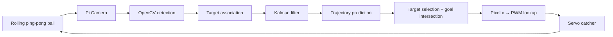

# Kalman Katcher

A Raspberry Pi computer-vision robotics project that detects and tracks rolling ping-pong balls, estimates their motion with a Kalman filter, predicts where they will cross a goal line, and moves a servo-driven catcher to intercept them.


[Kalman Katcher on YouTube](https://www.youtube.com/watch?v=kK27OdQG_vQ&ab_channel=JasonSheinkopf)

---

## Study / Teaching Documentation

This repository now includes a course-style explanation of the complete robotics system.

### [Robotics Study Guide](docs/ROBOTICS_STUDY_GUIDE.md)

Start here. It explains the entire system from the physical ball to the servo:

- camera coordinates and sensing
- OpenCV perception
- Hough circle detection
- corner/workspace calibration
- multi-object tracking
- data association
- Kalman state estimation
- covariance, `Q`, `R`, `F`, and `H`
- future trajectory prediction
- bounce modeling
- target selection
- goal-line geometry
- pixel-to-PWM actuator calibration
- servo control
- real-time threading
- prototype vs. production robotics design
- interview-ready robotics concepts

### [Kalman Filter Deep Dive](docs/KALMAN_FILTER_DEEP_DIVE.md)

A math-focused explanation of exactly what `kalman_filter.py` is doing:

- state vector
- process model
- measurement model
- innovation
- innovation covariance
- Kalman gain
- covariance update
- process and measurement noise
- initialization
- prediction/update timing
- Mahalanobis gating
- production estimator improvements

### [Code Walkthrough](docs/CODE_WALKTHROUGH.md)

A source-oriented tour of every important part of the implementation:

- `Target`
- `servo_dot()`
- `calibrate_corners()`
- `choose_target()`
- `servo_thread_fn()`
- the camera loop
- `Catcher.kf()`
- `Catcher.predict()`
- complete call graph
- end-to-end data flow

---

## System Architecture



At a high level, Kalman Katcher implements the classic robotics loop:

```text
SENSE → PERCEIVE → ESTIMATE → PREDICT → PLAN → ACT → SENSE AGAIN
```

---

## How It Works

1. The Pi Camera captures video at a nominal 40 FPS.
2. OpenCV template matching finds the four playfield corners.
3. The goal line and bounce boundaries are derived from those corner locations.
4. The Hough Circle Transform detects candidate ping-pong balls.
5. Brightness and goal-line rules filter false detections.
6. Detections are associated with existing `Target` objects using nearest-neighbor distance.
7. Each target maintains a Kalman-filter state:
   ```text
   [x, y, vx, vy, ay]
   ```
8. The Kalman filter fuses new camera measurements with the dynamics model.
9. The estimated state is propagated forward to generate a predicted trajectory.
10. Simple bounce rules model collisions with the playfield boundaries.
11. The ball predicted to reach the goal soonest is selected.
12. The last segment of its predicted trajectory is intersected with the goal line.
13. That intersection gives the desired catcher x coordinate in image pixels.
14. A calibration lookup table converts image x into a servo PWM pulse width.
15. A dedicated servo thread moves the catcher while the vision loop continues processing frames.

---

## Robotics Concepts Demonstrated

| Area | Concept |
|---|---|
| Perception | camera sensing, grayscale images, Hough transforms |
| Calibration | template matching, image-space workspace definition |
| Tracking | track identity, nearest-neighbor data association |
| State estimation | linear Kalman filtering |
| Uncertainty | covariance, process noise, measurement noise |
| Dynamics | discrete-time kinematics |
| Prediction | future state propagation |
| Hybrid systems | continuous motion + discrete bounce events |
| Planning | urgency-based target selection |
| Geometry | line-line intersection |
| Actuation | PWM servo control |
| System identification | empirical pixel-to-PWM mapping |
| Real-time systems | asynchronous perception and control loops |

---

## Kalman Filter

The camera directly observes only ball position:

[
z =
egin{bmatrix}
x \\
y
end{bmatrix}
]

The estimator maintains a larger hidden state:

[
x =
egin{bmatrix}
x \\
y \\
v_x \\
v_y \\
a_y
end{bmatrix}
]

The motion model predicts how the ball should move. The camera provides noisy observations. The Kalman filter combines both according to their uncertainty.

The core update is implemented in `kalman_filter.py`.

For the full derivation, see **[Kalman Filter Deep Dive](docs/KALMAN_FILTER_DEEP_DIVE.md)**.

---

## Creating the Servo Lookup Dictionary

The vision planner predicts a desired catcher location in **image pixels**, but the servo accepts a **PWM pulse width**.

Kalman Katcher learns this mapping empirically.

During calibration:

1. the servo sweeps from minimum to maximum PWM,
2. the camera observes the catcher crossing the goal line,
3. bright pixels identify the catcher arm,
4. the center position is measured in image coordinates,
5. the mapping `pixel x → PWM` is recorded,
6. the completed mapping is saved to `lookup.pkl`.


This avoids requiring an explicit inverse kinematic model for the linkage.

---

## Repository Layout

```text
kalman_katcher/
├── README.md
├── target_tracker.py
├── kalman_filter.py
├── lookup.pkl
├── memory.pkl
├── requirements.txt
├── templates/
│   ├── TL.jpg
│   ├── TR.jpg
│   ├── BL.jpg
│   └── BR.jpg
├── gif/
│   ├── kalman_catcher_short_demo.gif
│   └── kalibration.gif
└── docs/
    ├── ROBOTICS_STUDY_GUIDE.md
    ├── KALMAN_FILTER_DEEP_DIVE.md
    └── CODE_WALKTHROUGH.md
```

---

## Runtime Controls

| Key | Action |
|---|---|
| `q` | quit |
| `c` | recalibrate playfield corners |
| `t` | regenerate servo lookup table |
| `1 / a` | increase / decrease Hough `minDist` |
| `2 / s` | increase / decrease Hough `param1` |
| `3 / d` | increase / decrease Hough `param2` |
| `4 / f` | increase / decrease minimum radius |
| `5 / g` | increase / decrease maximum radius |

The Hough parameters are persisted in `memory.pkl`.

---

## Installation on the Raspberry Pi

### 1. Clone the repository

```bash
git clone https://github.com/jasonsheinkopf/kalman_katcher
cd kalman_katcher
```

### 2. Create a virtual environment

```bash
python -m venv kalman_venv
```

### 3. Activate it and install dependencies

```bash
source kalman_venv/bin/activate
pip install -r requirements.txt
```

### 4. Run the program

```bash
python target_tracker.py
```

The project depends on Raspberry Pi-specific camera/GPIO libraries and is intended to run on the physical Raspberry Pi setup.

---

## Best Way to Study This Repository

Use this order:

1. Read this README once for the architecture.
2. Read **[Robotics Study Guide](docs/ROBOTICS_STUDY_GUIDE.md)** and follow the data from camera to servo.
3. Open `target_tracker.py` beside **[Code Walkthrough](docs/CODE_WALKTHROUGH.md)**.
4. Open `kalman_filter.py` beside **[Kalman Filter Deep Dive](docs/KALMAN_FILTER_DEEP_DIVE.md)**.
5. Without looking, redraw this chain:

```text
camera
→ circle detection
→ target association
→ Kalman state
→ trajectory prediction
→ target choice
→ goal intersection
→ PWM lookup
→ servo
```

If you can explain every arrow and the uncertainty assumptions behind the Kalman filter, you understand the project at a robotics-system level.
