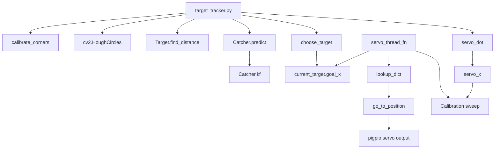

# Code Walkthrough — From Camera Frame to Servo Motion

This is a source-oriented companion to the robotics study guide.

## Repository map

```text
kalman_katcher/
├── README.md
├── target_tracker.py       # application, perception, tracking, planning, servo
├── kalman_filter.py        # state estimator + future path prediction
├── lookup.pkl              # calibrated pixel-x → PWM mapping
├── memory.pkl              # persisted Hough-circle parameters
├── requirements.txt
├── templates/
│   ├── TL.jpg
│   ├── TR.jpg
│   ├── BL.jpg
│   └── BR.jpg
└── gif/
    ├── kalman_catcher_short_demo.gif
    └── kalibration.gif
```

## 1. `Target`

A `Target` is the software representation of one physical ping-pong ball.

Important fields:

| Field | Meaning |
|---|---|
| `id` | persistent local track identifier |
| `x, y` | latest detected center |
| `r` | latest detected radius |
| `P` | Kalman covariance matrix |
| `kfx` | Kalman state vector |
| `observations` | history of measured centers |
| `future_points` | predicted trajectory |
| `goal_x` | intended interception x |

`find_distance(circle)` is used for greedy nearest-neighbor association.

## 2. `servo_dot()`

Purpose: observe where the physical catcher arm crosses the goal line during calibration.

It:
1. samples 100 pixels along the goal line,
2. selects bright samples,
3. averages their indices,
4. converts that average back into an image coordinate,
5. applies a small perspective correction,
6. writes the result to global `servo_x`.

It does not move the servo. It visually measures servo/catcher position.

## 3. `save_params()`

Serializes circle-detector tuning to `memory.pkl`.

This separates persistent perception calibration from source code.

## 4. `calibrate_corners()`

Loads the four corner templates and performs normalized correlation template matching.

It returns:
- top-left,
- bottom-right,
- top-right,
- bottom-left,
- goal-left point,
- goal-right point.

The boundaries later serve three jobs:
- visualization,
- future bounce simulation,
- defining the interception line.

## 5. Global configuration

Key parameters include:

```python
framerate = 40
MIN_PWM = 750
MAX_PWM = 2100
GOAL_Y_OFFSET = 30
width, height = 300, 480
```

The Kalman object is constructed with:

```python
Catcher(dt=1/framerate)
```

This couples estimator discretization to nominal camera rate.

## 6. Loading calibration

At startup:

- `lookup.pkl` is loaded for actuator mapping.
- `memory.pkl` is loaded for Hough Circle parameters.

If `lookup.pkl` is absent, the code creates an empty dictionary. Note that the separate `have_lookup_pickle` flag is hard-coded true in the present source, so a missing lookup file would need that flow to be handled carefully before runtime targeting.

## 7. pigpio setup

GPIO 13 is configured as output.

The PWM frequency is set to 50 Hz, a common hobby-servo control frequency.

`set_servo_pulsewidth()` then controls position through pulse width in microseconds.

## 8. `choose_target()`

If targets exist:

1. choose the one whose predicted terminal point has the smallest time index,
2. if no valid impact exists, choose the lowest visible target and aim center,
3. otherwise take the final two predicted trajectory points,
4. intersect their line with the physical goal line,
5. store the resulting x as `current_target.goal_x`.

This function is the bridge from prediction to planning.

## 9. `go_to_position()`

Calls:

```python
pwm.set_servo_pulsewidth(servo, position)
```

then sleeps 0.3 seconds.

That sleep substantially limits actuator command update rate relative to the camera loop.

## 10. `servo_thread_fn()`

The actuator thread has two modes.

### Calibration mode

When `have_lookup_pickle == False`:

1. start at `MIN_PWM`,
2. sweep upward in increments of 10,
3. move the servo,
4. read the visually observed global `servo_x`,
5. save `servo_x → PWM`,
6. write `lookup.pkl`.

### Runtime mode

If a `current_target` exists:

1. read its `goal_x`,
2. find nearest calibrated x,
3. retrieve PWM,
4. command servo.

If no target exists, return to center.

## 11. Camera initialization

The Pi Camera is configured with:
- 300×480 resolution,
- 90° rotation,
- 40 FPS,
- shutter speed 4500.

`PiRGBArray` provides OpenCV-compatible frames.

## 12. Main capture loop

The main loop runs over `camera.capture_continuous(...)`.

### A. Frame preparation

```python
image = frame.array
gray = cv2.cvtColor(image, cv2.COLOR_BGR2GRAY)
```

### B. Boundary calibration

On frame 0 or key `c`, corner templates define workspace geometry.

### C. Optional actuator calibration observation

If lookup generation is active, `servo_dot()` identifies catcher location.

### D. Circle detection

`cv2.HoughCircles` proposes circular objects.

Only candidates with a bright center and position above the goal are accepted.

### E. Track association

The code compares:
- number of old targets,
- number of new circle detections.

A two-frame mismatch threshold suppresses one-frame count glitches.

Then greedy nearest-neighbor association updates track identity.

### F. Kalman update

For each target:

```python
target.observations.append((target.x, target.y))
target = catcher.predict(...)
```

The first observation initializes the state.

Later observations run the Kalman measurement/prediction step and generate future trajectory points.

### G. Visualization

The program draws:
- measured circle,
- estimated state marker,
- future trajectory,
- predicted goal intersection,
- playfield boundaries.

### H. Target selection

```python
current_target = choose_target(new_targets)
```

That shared object is what the servo thread consumes.

### I. Runtime controls

Keyboard commands modify detector parameters, recalibrate the scene, rebuild actuator calibration, or quit.

### J. Frame cleanup

```python
rawCapture.truncate(0)
```

resets the camera buffer for the next frame.

## 13. `Catcher.__init__()`

The estimator defines:

- sensor noise `R`,
- process noise `Q`,
- transition matrix `F`,
- observation matrix `H`,
- identity matrix `I`,
- bounce damping,
- sample interval.

The state is five-dimensional.

## 14. `Catcher.kf()`

The exact sequence is:

```text
camera observation
→ innovation
→ innovation covariance
→ Kalman gain
→ state correction
→ covariance correction
→ dynamics prediction
→ covariance prediction
```

Returned `x,P` are ready for the next cycle.

## 15. `Catcher.predict()`

On the first observation:
- initializes x/y from detector,
- guesses vx/vy/ay,
- initializes P.

After later observations:
1. run `kf()`,
2. copy the state,
3. project into the future,
4. apply bounce rules,
5. append predicted coordinates,
6. stop when goal is reached or prediction is considered invalid.

## 16. End-to-end call graph



## 17. The full state/data chain

```text
Physical ball
  ↓ photons
Camera image
  ↓ OpenCV
Circle measurement (x,y,r)
  ↓ association
Target identity
  ↓ Kalman fusion
Estimated [x,y,vx,vy,ay]
  ↓ forward model
future_points[]
  ↓ target policy
selected target
  ↓ line intersection
goal_x in pixels
  ↓ calibration lookup
PWM pulse width
  ↓ pigpio
servo angle / catcher position
  ↓
Physical interception
```

If you can reconstruct this chain without looking at the code, you understand the repository at the system level.
