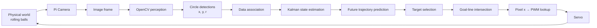
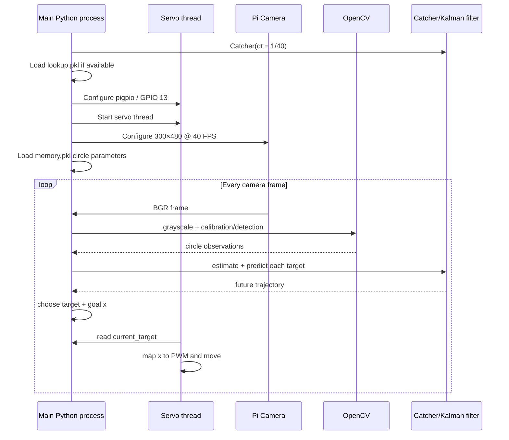
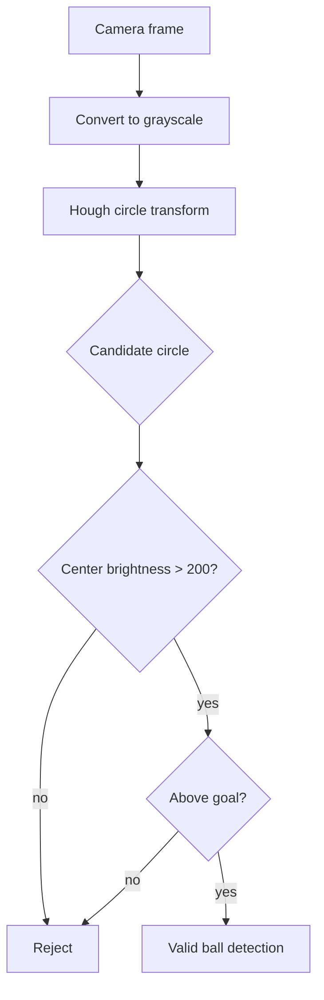
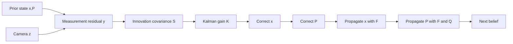
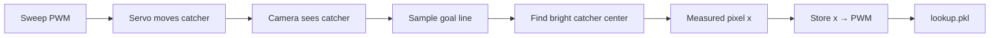
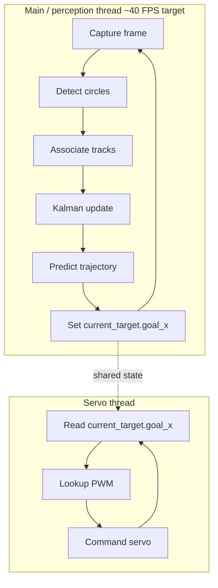
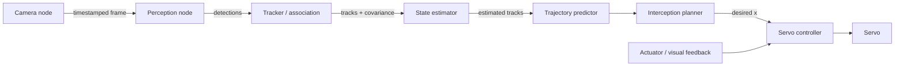

# Kalman Katcher — Robotics Study Guide

> A course-style explanation of the complete perception–estimation–prediction–control pipeline in this repository.

This guide is written to help you study **robotics**, not merely memorize this code. It connects each implementation choice in Kalman Katcher to the broader ideas used in mobile robots, autonomous vehicles, industrial robotics, drones, and embedded perception systems.

---

## 1. What the robot actually does

Kalman Katcher watches ping-pong balls roll down a sloped surface and moves a servo-driven catcher to the predicted point where the selected ball will cross a goal line.

The problem looks simple, but it contains most of the pieces of a real robotic system:

1. **Sense** the world with a camera.
2. **Perceive** objects in images.
3. **Associate** detections between frames.
4. **Estimate state** from noisy measurements.
5. **Predict dynamics** into the future.
6. **Reason about geometry** to find the goal-line intersection.
7. **Select a target** when multiple objects exist.
8. **Translate desired Cartesian position into actuator command** through calibration.
9. **Actuate** a servo.
10. Repeat in real time.

That is a closed perception-to-action loop.



The main application is in `target_tracker.py`. The state estimator and future-trajectory logic are in `kalman_filter.py`.

---

## 2. The robotics stack in this project

| Robotics layer | Kalman Katcher implementation | General robotics term |
|---|---|---|
| Sensor | Raspberry Pi camera | exteroceptive sensor |
| Raw measurement | Image frame | sensor observation |
| Perception | grayscale + Hough circles | object detection |
| Landmark/workspace calibration | template matching of four corners | environment calibration |
| Multi-object tracking | nearest detection to existing target | data association |
| State estimation | custom Kalman filter | Bayesian filtering |
| State | `[x, y, vx, vy, ay]` | latent state vector |
| Motion model | matrix `F` | process / dynamics model |
| Measurement model | matrix `H` | observation model |
| Prediction | repeated state propagation | forward simulation |
| Collision model | wall/top bounce rules | hybrid dynamics |
| Planning | choose earliest predicted goal crossing | reactive task planning |
| Coordinate mapping | pixel-x → PWM lookup table | actuator calibration / inverse mapping |
| Actuation | servo pulse width | low-level control |
| Concurrency | servo thread + vision loop | asynchronous control architecture |

This project is therefore more than “a Kalman filter demo.” It is a small robotic system with perception, estimation, prediction, decision-making, calibration, and actuation.

---

# Part I — Coordinate system and physical model

## 3. Camera coordinates

The camera image is configured as:

- width = **300 px**
- height = **480 px**
- camera rotation = **90°**
- frame rate = **40 FPS**

OpenCV image coordinates use:

- positive **x** to the right
- positive **y** downward
- origin `(0, 0)` at the image's top-left

```text
(0,0) ───────────────→ +x
  │
  │       ball
  │        ○
  │
  ↓
 +y
              goal line
────────────────────────────
```

That coordinate convention matters because a ball rolling downward generally has **positive y velocity**, while a ball moving upward after a bounce has **negative y velocity**.

The state estimator is initialized with `vy = -800`, which expresses an initial upward motion assumption in image coordinates. Gravity-like acceleration `ay = 5000` then pushes the vertical velocity toward positive values.

---

## 4. State versus measurement

A core robotics distinction is:

**Measurement:** what the sensor directly tells us.

For this project:

[
z =
egin{bmatrix}
x_{measured} \\
y_{measured}
end{bmatrix}
]

The camera never directly measures velocity or acceleration.

**State:** the hidden physical quantities the robot wants to know.

Kalman Katcher uses:

[
x =
egin{bmatrix}
x \\
y \\
v_x \\
v_y \\
a_y
end{bmatrix}
]

So the filter estimates five variables from only two directly observed quantities.

This is one of the central ideas of state estimation: **infer unobserved state from a sequence of noisy observations plus a dynamics model.**

---

# Part II — Startup and calibration

## 5. Startup sequence

When `target_tracker.py` starts, the major sequence is:



Two loops are effectively running:

- the **vision/main loop**
- the **servo-control thread**

They communicate through shared global state, especially `current_target`.

---

## 6. Workspace calibration with corner templates

The program needs to know where the physical playfield is in the camera image.

The `templates/` directory contains four grayscale image templates:

- `TL.jpg`
- `TR.jpg`
- `BL.jpg`
- `BR.jpg`

On the first frame—or when the user presses **c**—`calibrate_corners(gray)` runs OpenCV template matching:

```python
cv2.matchTemplate(gray, template, cv2.TM_CCOEFF_NORMED)
```

For each template, `cv2.minMaxLoc` finds the location with the strongest normalized correlation.

From those matches, the program computes:

- top-left boundary point
- top-right boundary point
- bottom-left boundary point
- bottom-right boundary point
- left end of the goal line
- right end of the goal line

The goal line is placed **30 pixels below** the detected lower boundary:

```python
GOAL_Y_OFFSET = 30
```

The resulting `boundaries` dictionary contains approximate left/right/top limits plus the two goal-line endpoints.

### Robotics concept

This is a simple form of **extrinsic workspace calibration**. The project does not estimate a full camera homography or metric world coordinates. Instead, it directly uses image coordinates as the working coordinate frame.

That is perfectly reasonable when:

- the camera is fixed,
- the surface is fixed,
- the actuator is calibrated in that same image frame,
- metric distances are unnecessary.

In industrial robotics, this pattern is often called **image-based control** or **visual servoing in image space**.

---

# Part III — Perception

## 7. Detecting the ping-pong balls

Each frame is converted from BGR to grayscale:

```python
gray = cv2.cvtColor(image, cv2.COLOR_BGR2GRAY)
```

Then the program uses the Hough Circle Transform:

```python
cv2.HoughCircles(gray, cv2.HOUGH_GRADIENT, **circle_params)
```

The tunable parameters live in `circle_params` and are persisted to `memory.pkl`.

The defaults are:

| Parameter | Default | Purpose |
|---|---:|---|
| `dp` | 1 | accumulator/image resolution ratio |
| `minDist` | 50 | minimum center separation |
| `param1` | 50 | upper threshold used by internal edge detection |
| `param2` | 20 | Hough accumulator threshold |
| `minRadius` | 13 | smallest accepted circle |
| `maxRadius` | 22 | largest accepted circle |

After Hough detection, a candidate is retained only if:

1. its center pixel is bright: `gray[y, x] > 200`
2. it is still above the goal line

So Hough geometry proposes “this looks circular,” and brightness/position rules reject some false positives.



### General robotics lesson

Perception pipelines often combine:

- a generic detector,
- domain-specific filtering,
- geometry constraints.

The extra rules are not “cheating.” They are **prior knowledge** about the task.

---

# Part IV — Multi-object tracking and data association

## 8. Why detection is not tracking

Suppose frame 100 contains circles at:

```text
(80, 120)
(210, 190)
```

and frame 101 contains:

```text
(83, 128)
(206, 203)
```

The detector gives two new circles. It does **not** tell the program which new circle belongs to which old ball.

That is the **data association problem**.

Kalman Katcher uses greedy nearest-neighbor association.

Each `Target` object stores:

- `id`
- current `x, y, r`
- covariance `P`
- estimated state `kfx`
- observation history
- predicted future points
- desired goal x
- impact time placeholder

Its `find_distance()` method computes Euclidean distance from the target's current position to a candidate circle.

### Association when detections ≥ current targets

For each existing target:

1. sort the candidate circles by distance,
2. take the closest one,
3. update that target,
4. remove that circle from the available list.

Remaining detections become new `Target` objects.

### Association when detections < current targets

For each detected circle:

1. sort targets by distance,
2. assign the closest target,
3. remove that target from the available list.

Targets that cannot be matched disappear from the new active list.

---

## 9. Count-change hysteresis

One bad detector frame should not immediately create or destroy tracks.

The code uses:

```python
update_threshold = 2
change_count = 0
```

If the number of detections differs from the number of targets, it initially carries the existing targets forward and increments `change_count`.

Only after the mismatch persists does it accept the changed count.

This is a small example of **temporal hysteresis**: require evidence to persist before changing system state.

### Limitations of the association method

Greedy nearest-neighbor is fast and understandable, but it can fail if:

- balls cross each other,
- a detection jumps far between frames,
- a false positive appears near a target,
- a target becomes temporarily occluded,
- assignment order causes a locally good but globally bad matching.

Production trackers often use:

- gating based on predicted covariance,
- Hungarian assignment,
- JPDA,
- multiple-hypothesis tracking,
- learned appearance embeddings.

For this physical setup, simple nearest-neighbor tracking can be entirely adequate.

---

# Part V — Kalman filtering

## 10. Why a Kalman filter is useful here

A camera measurement is noisy. If the robot reacts directly to every detected center:

- estimated velocity will jump,
- predicted impact position will jump,
- the servo will chase noise.

The Kalman filter maintains a **belief** about state:

> “Given everything I have observed so far, and given how I believe balls move, where is the ball and how fast is it probably moving?”

It combines two information sources:

1. **measurement evidence**
2. **model prediction**

Each source carries uncertainty.

---

## 11. The state transition matrix

The filter's state is:

[
mathbf{x} = [x,;y,;v_x,;v_y,;a_y]^T
]

Its transition matrix is:

[
F =
egin{bmatrix}
1 & 0 & dt,r & 0 & 0 \\
0 & 1 & 0 & dt,r & dt^2/2 \\
0 & 0 & r & 0 & 0 \\
0 & 0 & 0 & r & dt \\
0 & 0 & 0 & 0 & 1
end{bmatrix}
]

with `r = 1` in the current configuration.

Multiplying `F x` gives approximately:

[
x_{new} = x + v_x dt
]

[
y_{new} = y + v_y dt + rac{1}{2}a_y dt^2
]

[
v_{x,new} = v_x
]

[
v_{y,new} = v_y + a_y dt
]

[
a_{y,new} = a_y
]

That is a **constant-vertical-acceleration model** with constant horizontal velocity.

The camera period is:

[
dt = rac{1}{40} = 0.025 	ext{ s}
]

---

## 12. Measurement matrix

The camera observes x and y only, so:

[
H =
egin{bmatrix}
1 & 0 & 0 & 0 & 0 \\
0 & 1 & 0 & 0 & 0
end{bmatrix}
]

Then:

[
Hmathbf{x} =
egin{bmatrix}
x \\
y
end{bmatrix}
]

This is how the filter maps its five-dimensional hidden state into the two-dimensional measurement space.

---

## 13. Covariance: the language of uncertainty

The state covariance matrix `P` represents uncertainty about the estimated state.

Conceptually:

[
P =
egin{bmatrix}
sigma_x^2 & cdots \\
dots & ddots
end{bmatrix}
]

The diagonal terms are variances. Off-diagonal terms capture correlations between state errors.

Initial variances in this code are intentionally different:

- position variances are tiny,
- velocity variances are much larger,
- acceleration has its own variance.

That means the initial ball location is treated as relatively certain because it comes from an actual detection, while hidden velocity is much less certain because it was only initialized from a prior guess.

---

## 14. R and Q

### Measurement covariance R

[
R =
egin{bmatrix}
R_x & 0 \\
0 & R_y
end{bmatrix}
]

`R` describes uncertainty in the camera measurement.

Larger `R` means:

> “My detector is noisy. Do not chase each measurement too aggressively.”

Smaller `R` means:

> “Measurements are accurate. Correct the model strongly when the camera disagrees.”

### Process covariance Q

`Q` describes uncertainty in the dynamics model.

This project uses a diagonal `Q` for uncertainty in:

- x position evolution
- y position evolution
- x velocity evolution
- y velocity evolution
- y acceleration evolution

Larger `Q` means:

> “The physical model is imperfect; allow the state estimate to move away from it.”

That tradeoff between `Q` and `R` is one of the most important Kalman-filter tuning ideas.

---

## 15. One complete filter update

The implementation uses the latest observation first, then propagates the corrected state forward.

### Step 1 — observation

[
z =
egin{bmatrix}
x_m \\
y_m
end{bmatrix}
]

### Step 2 — innovation / residual

[
y = z - Hx
]

The innovation is simply:

> what the camera saw − what the current state expected the camera to see

### Step 3 — innovation covariance

[
S = HPH^T + R
]

This represents uncertainty in that residual.

### Step 4 — Kalman gain

[
K = PH^T S^{-1}
]

The gain controls how strongly measurement residual affects the state correction.

### Step 5 — state correction

[
x leftarrow x + Ky
]

### Step 6 — covariance correction

[
P leftarrow (I-KH)P
]

### Step 7 — state prediction

[
x leftarrow Fx + u
]

Here `u = 0`, meaning there is no modeled external control input acting on the ball.

### Step 8 — covariance prediction

[
P leftarrow FPF^T + Q
]

The final returned state is therefore the **one-step-ahead predicted state after incorporating the current observation**.



---

## 16. A correction to one source-code comment

One comment in `kalman_filter.py` describes the Kalman gain direction backwards.

The useful intuition is:

- **small gain** → remain closer to the model/prior
- **larger gain** → respond more strongly to the measurement innovation

The gain is a matrix, so “0 versus 1” is only an intuition, not a literal universal scalar interpretation.

Understanding this correctly is important for interviews.

---

# Part VI — Future trajectory prediction

## 17. From filtering to forecasting

Filtering asks:

> Where is the ball now?

The catcher actually needs a harder answer:

> Where will the ball cross the goal line?

After a target has more than one observation, `Catcher.predict()` first runs the Kalman filter, then creates `future_points`.

The trajectory is extended until either:

- predicted y reaches the goal line, or
- the prediction horizon reaches the limit.

Each stored future point contains:

```python
(x, y, t)
```

where `t` is a prediction-step indicator.

---

## 18. Bounce model

Future points are checked against approximate workspace boundaries.

### Right/left wall

If the ball reaches a side while moving outward:

```python
vx *= -damping
vy *= damping
```

with:

```python
damping = 0.5
```

So horizontal direction reverses and speed is reduced.

### Top boundary

If the predicted ball goes above the top while traveling upward:

```python
vy *= -damping
```

This is a simple **hybrid dynamics model**:

- continuous state propagation between impacts,
- discrete velocity change when an impact event occurs.

That same continuous/discrete mixture appears in many robotic simulations.

---

## 19. Important implementation subtlety in the future predictor

The current predictor creates a matrix using:

```python
e_time = t * dt
```

and applies it to `next_kfx`, which already contains the previous prediction.

So the successive transforms use horizons of `dt`, then `2dt`, then `3dt`, etc. **on top of the already propagated state**.

That is not the usual fixed-step propagation.

Two textbook-consistent alternatives would be:

1. repeatedly propagate the previous state using a constant one-frame `F(dt)`, or
2. compute every horizon `F(t·dt)` directly from the same current state.

The existing implementation can still work empirically after tuning, but this distinction is valuable when studying robotics because **model discretization and time indexing matter**.

---

# Part VII — Target selection and interception geometry

## 20. Which ball should the robot catch?

For every active ball, the filter predicts future points.

`choose_target()` selects:

```python
min(new_targets,
    key=lambda target: target.future_points[-1][2])
```

So the preferred target is the one predicted to impact soonest.

If no valid future goal crossing was found, the fallback is:

1. choose the target already lowest on screen,
2. send the catcher to the center.

This is a simple scheduling policy:

> prioritize the most urgent intercept.

---

## 21. Goal-line intersection

The final two predicted trajectory points straddle the goal region:

- `before`
- `after`

The code fits a line through those points:

[
y = m_p x + b_p
]

and a line through the goal endpoints:

[
y = m_g x + b_g
]

Their intersection is:

[
x_{goal} =
rac{b_g-b_p}{m_p-m_g}
]

That predicted x coordinate becomes:

```python
current_target.goal_x
```

So there is an important chain:

```text
estimated state
    ↓
predicted trajectory
    ↓
goal-line crossing
    ↓
desired catcher pixel x
```

This is the project’s interception planner.

---

# Part VIII — Servo calibration and control

## 22. Why PWM cannot be guessed from image x

The planner produces a desired position in **pixels**.

The servo accepts a **pulse width**.

Those are different coordinate systems.

Instead of deriving a mechanical kinematic equation, Kalman Katcher experimentally learns a lookup:

```text
catcher pixel x  →  servo pulse width
```

That is system calibration.

---

## 23. Building lookup.pkl

When the lookup table is regenerated, the servo thread sweeps:

```python
MIN_PWM = 750
MAX_PWM = 2100
```

in increments of 10.

At each actuator position, the main vision loop runs `servo_dot()`.

`servo_dot()`:

1. samples 100 points along the goal line,
2. checks which samples are bright,
3. treats the bright region as the white catcher arm,
4. finds the center of that bright region,
5. makes a small perspective correction,
6. stores the result globally as `servo_x`.

The servo thread then records:

```python
lookup_dict[servo_x] = goal_pos
```

and serializes the mapping to `lookup.pkl`.



This is a very useful robotics concept: **empirical actuator calibration can replace an explicit inverse kinematics model when the geometry is fixed.**

---

## 24. Runtime servo command

At runtime, the servo thread reads:

```python
current_target.goal_x
```

Then it finds the nearest calibrated x key:

```python
closest_key = min(
    lookup_dict,
    key=lambda key: abs(current_target_x - key)
)
```

and commands the corresponding PWM value.

If no target exists, the servo returns to the midpoint:

[
rac{MAX_PWM + MIN_PWM}{2}
]

The lookup currently uses nearest-neighbor selection rather than interpolation.

---

# Part IX — Real-time architecture

## 25. Why there is a servo thread

If servo movement blocked the image-processing loop, the camera tracker could miss frames.

Instead, a separate Python thread handles the actuator.



This is an example of **asynchronous robotics software**.

The perception loop and actuator loop do not execute at the same effective rate.

Note that `go_to_position()` sleeps for 0.3 s, so the servo thread updates far more slowly than the nominal 40 FPS vision loop.

That is a form of **multi-rate system**.

---

## 26. Shared-state concurrency

The threads communicate through globals:

- `current_target`
- `goal_pos`
- `lookup_dict`
- `servo_x`
- `have_lookup_pickle`
- `exit_event`

There are no locks.

For a small Python prototype, this can be workable because assignments of simple object references are atomic under CPython's interpreter lock, and slightly stale data is tolerable.

For a production robotics system, you would generally prefer:

- message queues,
- explicit synchronized state,
- ROS topics,
- lock-protected shared structures,
- or timestamped dataflow.

The architecture lesson is more important than the Python mechanism:

> sensing and actuation often run at different rates and must exchange state safely.

---

# Part X — Complete frame-by-frame walkthrough

## 27. What happens on one camera frame

For each captured frame:

1. Save the previous active target list.
2. Create a new empty target list.
3. Extract the BGR image.
4. Convert to grayscale.
5. Check the keyboard.
6. If first frame or **c**, recalibrate workspace boundaries.
7. If generating the actuator lookup, estimate catcher-arm x.
8. Draw playfield boundaries.
9. Run Hough circle detection.
10. Reject circles that are not bright or are beyond the goal.
11. Compare number of detections to number of current tracks.
12. Apply count-change hysteresis if needed.
13. Associate detections with existing targets using nearest distance.
14. Create new target objects for unmatched detections.
15. For every active target:
    - draw observed circle,
    - append observation,
    - perform Kalman update/prediction,
    - draw estimated state,
    - simulate future trajectory,
    - draw predicted path.
16. Choose the target with the most urgent predicted impact.
17. Compute its goal-line crossing.
18. Publish that desired x implicitly through `current_target`.
19. Process tuning/calibration keyboard commands.
20. Display the annotated image.
21. Clear the camera buffer.
22. Continue.

Meanwhile, independently:

1. servo thread reads `current_target`,
2. maps desired pixel x to the closest PWM calibration,
3. commands the actuator,
4. repeats.

That is the complete control loop.

---

# Part XI — Persistent files

## 28. lookup.pkl

`lookup.pkl` stores the experimentally learned mapping:

```text
pixel x → servo PWM pulse width
```

It is part of **actuator calibration**.

If the camera or catcher geometry moves physically, the mapping may no longer be valid.

---

## 29. memory.pkl

`memory.pkl` stores Hough Circle parameters adjusted through keyboard commands.

This lets perception tuning persist between launches.

The project therefore has two separate calibration memories:

| File | Calibrates |
|---|---|
| `memory.pkl` | perception |
| `lookup.pkl` | actuation |

That is a useful systems-design distinction.

---

# Part XII — Keyboard controls

## 30. Runtime controls

| Key | Action |
|---|---|
| `q` | quit |
| `c` | recalibrate corner templates |
| `t` | regenerate actuator lookup table |
| `1/a` | increase/decrease `minDist` |
| `2/s` | increase/decrease `param1` |
| `3/d` | increase/decrease `param2` |
| `4/f` | increase/decrease `minRadius` |
| `5/g` | increase/decrease `maxRadius` |

Changes to Hough parameters are saved immediately to `memory.pkl`.

---

# Part XIII — Code-quality and study notes

## 31. Prototype implementation details worth recognizing

These points are not reasons to dismiss the project. They are exactly the kinds of details that show how a prototype can evolve into a production robotic system.

### A. Kalman-gain comment direction

As noted earlier, one source comment reverses the intuitive meaning of low and high Kalman gain.

### B. Display-only acceleration extraction

In `target_tracker.py`:

```python
ay = int(target.kfx[3].item())
```

index 3 is `vy`; acceleration is index 4. The variable is not subsequently used, so this does not affect control.

### C. Initial goal_pos expression

One early initialization uses:

```python
(MAX_PWM - MIN_PWM) / 2
```

while the actual PWM midpoint is:

```python
(MAX_PWM + MIN_PWM) / 2
```

Later runtime logic uses the correct midpoint.

### D. Prediction time compounding

The future predictor compounds growing time-step matrices, discussed earlier. A cleaner model would use constant-step propagation or absolute-horizon propagation from a fixed state.

### E. Greedy association has no gate

Any nearest detection can be associated with a target regardless of how implausibly far away it is. A covariance-based Mahalanobis gate would be more robust.

### F. No timestamps per frame

The filter assumes the camera period is always exactly `1/40` s. A production system often computes `dt` from actual timestamps.

### G. Servo control is open-loop after calibration

The runtime command selects a PWM from a lookup table but does not continuously verify that the catcher reached the requested x. A closed-loop visual servo could measure catcher position and correct error.

### H. Calibration assumes fixed geometry

Template matches and pixel/PWM mapping depend on the camera and physical rig not moving.

---

# Part XIV — How this maps to larger robotics systems

## 32. Kalman Katcher versus autonomous driving

| Kalman Katcher | Autonomous vehicle analogue |
|---|---|
| Pi Camera | camera/radar/lidar |
| Hough circles | object detector |
| target IDs | tracked actors |
| nearest-neighbor matching | multi-object association |
| state `x,y,vx,vy,ay` | tracked kinematic state |
| covariance | localization/tracking uncertainty |
| wall bounce model | motion prediction model |
| goal-line crossing | collision/intercept prediction |
| choose soonest target | risk prioritization |
| pixel→PWM lookup | actuator/control mapping |
| servo | steering/braking actuator |

The scale is different, but many abstractions are the same.

---

## 33. Kalman Katcher versus a mobile robot

A mobile robot might replace:

- ball position with robot pose,
- camera circles with lidar landmarks,
- state with `[x, y, heading, velocity]`,
- actuator lookup with wheel velocity commands.

The core estimator structure remains:

```text
predict state from dynamics
+
correct state from sensor measurement
=
better state estimate
```

---

# Part XV — Interview-ready concepts

## 34. Questions you should be able to answer

### “Why use a Kalman filter instead of averaging detections?”

An average only smooths observations. A Kalman filter combines observations with a **dynamic state model**, tracks uncertainty, and estimates hidden variables like velocity and acceleration.

### “What is P?”

The covariance of the state-estimation error. It represents how uncertain the filter is about its estimated state and correlations between state dimensions.

### “What is Q?”

Process noise covariance: uncertainty in the motion model.

### “What is R?”

Measurement noise covariance: uncertainty in the sensor/detector measurement.

### “What does H do?”

It maps hidden state into measurement space. Here it extracts x and y because the camera directly observes only those components.

### “What does F do?”

It propagates state through time using the assumed ball dynamics.

### “What is the innovation?”

The measurement residual `z - Hx`: the disagreement between the actual measurement and predicted measurement.

### “What does the Kalman gain do?”

It weights how strongly the innovation should correct the current state estimate based on uncertainty in the prior and measurement.

### “What is data association?”

Deciding which detection in the current frame corresponds to which already-tracked physical object.

### “Why calibrate pixel x to PWM?”

The vision planner operates in image coordinates while the actuator operates in pulse-width commands. Calibration creates a mapping between those coordinate domains.

### “Is this closed-loop control?”

The complete robot is perception-to-action feedback because new camera frames continually affect future commands. However, the individual servo command is largely **lookup-based/open-loop** rather than a dedicated position-error feedback controller.

### “What would you improve first?”

Strong answers include timestamped `dt`, gated global data association, better physical trajectory propagation, explicit thread-safe messaging, and closed-loop actuator feedback.

---

# Part XVI — A deeper robotics learning path

## 35. Study this repository in this order

### Level 1 — Follow the data

Trace:

```text
camera frame
→ gray image
→ circle
→ Target
→ Kalman state
→ future_points
→ goal_x
→ lookup_dict
→ PWM
→ servo
```

If you can explain every arrow, you understand the system architecture.

### Level 2 — Understand estimation

Be able to explain:

- state
- measurement
- covariance
- innovation
- Kalman gain
- process noise
- measurement noise
- prediction
- correction

### Level 3 — Understand dynamics

Derive the equations represented by `F`.

Ask:

- Why is there x velocity but no x acceleration?
- Why is y acceleration included?
- What does `dt²/2` mean?
- What happens if the frame rate changes?

### Level 4 — Understand perception

Study:

- grayscale conversion
- Hough circles
- template matching
- thresholding
- false positives / false negatives

### Level 5 — Understand tracking

Study:

- nearest-neighbor association
- gating
- Hungarian algorithm
- track birth/death
- occlusion handling

### Level 6 — Understand control

Study:

- feedforward vs feedback
- open-loop vs closed-loop
- actuator calibration
- PID control
- visual servoing
- latency

### Level 7 — Understand real-time systems

Study:

- sensor rate
- control rate
- latency
- concurrency
- synchronization
- stale data
- deterministic timing

---

# Part XVII — Suggested next-generation architecture

## 36. If this were rebuilt as a production robotics system

A more structured architecture might look like:



Potential improvements:

1. timestamp every observation,
2. model detector covariance,
3. perform prediction before association,
4. use Mahalanobis gating,
5. solve assignments globally,
6. make track lifecycle explicit,
7. fix future propagation time semantics,
8. interpolate the calibration table,
9. close the servo position loop,
10. use queues instead of globals,
11. log latency and missed frames,
12. separate perception, estimation, planning, and control modules.

That evolution mirrors the transition from a prototype to production robotics software.

---

# Part XVIII — The essential mental model

## 37. One sentence per subsystem

**Perception:** Turn pixels into candidate ball measurements.

**Association:** Decide which measurement belongs to which ball.

**Estimation:** Combine noisy measurements with a motion model to estimate hidden kinematic state.

**Prediction:** Propagate that state forward to estimate the future path.

**Planning:** Pick the ball that needs attention and determine where it will cross the goal.

**Calibration:** Convert desired image-space location into an actuator-space command.

**Control:** Move the servo toward that command while perception continues to update the plan.

That is Kalman Katcher.

---

## 38. The most important robotics idea in the repository

The most important idea is not the matrix algebra itself.

It is this:

> **A robot never has perfect knowledge of the world. It acts using an internal state estimate built from imperfect sensors and imperfect models.**

Kalman Katcher makes that idea concrete. The camera measurements are imperfect. The motion model is imperfect. The servo calibration is imperfect. Yet by repeatedly sensing, estimating, predicting, and acting, the robot can still intercept a moving physical object.

That feedback loop is the heart of robotics.
